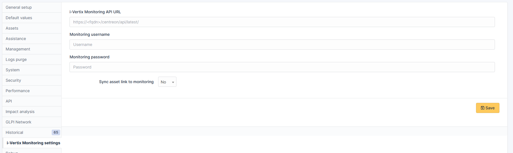
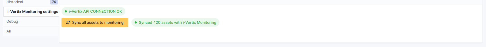
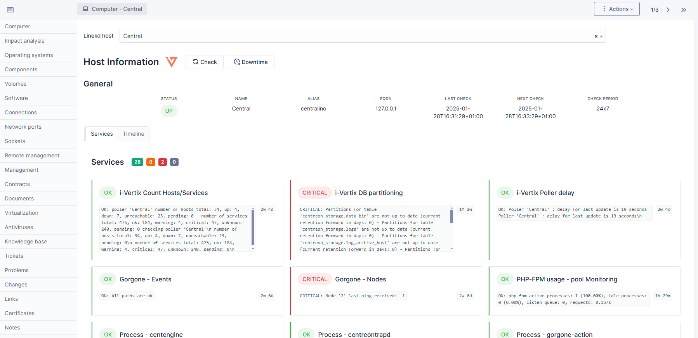
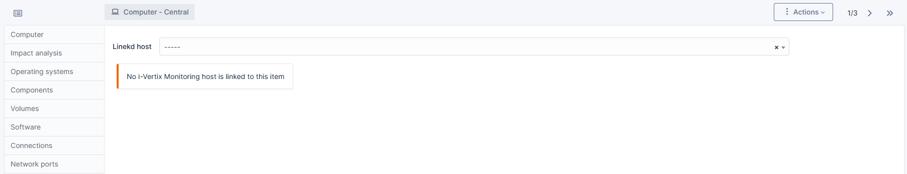
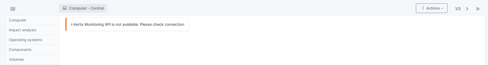
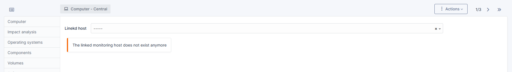
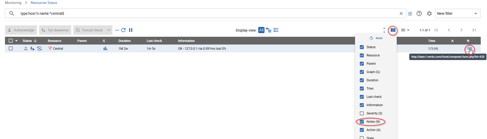

[](https://i-vertix.com)

# i-Vertix Monitoring GLPI plugin

This plugin is used to integrate realtime monitoring information from the i-Vertix Monitoring into GLPI.

Currently, the plugin supports GLPI version 10+ and following asset types:

- Computers
- Network devices

## 🔧 Installation

1. Download the latest version
   from [https://github.com/i-Vertix/glpi-i-vertix-monitoring/releases](https://github.com/i-Vertix/glpi-i-vertix-monitoring/releases).
2. Extract the archive into the GLPI plugins folder
3. Verify, that the folder `ivertixmonitoring` is created
4. On Linux, make sure the `ivertixmonitoring` folder and all of its subfolders have the following permissions:

    ```bash
    sudo chown apache:apache -R ./ivertixmonitoring
    sudo chmod 644 -R ./ivertixmonitoring
    sudo chmod 755 ./ivertixmonitoring
    sudo find ./ivertixmonitoring -type d -exec chmod 755 {} +
    ```

   Basically, the `ivertixmonitoring` plugin folder and all of its subfolders must have the permission level `rwxr-xr-x`
   (755) and all the files inside `rw-r--r--` (644)

5. Log into GLPI with a super-admin account and install the plugin

## ⚙️ Plugin Configuration

The i-Vertix Monitoring API is used to fetch realtime monitoring data for connected assets.

### 🔑 i-Vertix Monitoring user

You need an active i-Vertix Monitoring user for the plugin configuration.
It is recommended to create a dedicated user for your GLPI Monitoring integration.

The user must have the following permissions:

- view relevant hosts and services
- set downtimes on hosts and services
- view downtimes
- acknowledge host and service problems
- force checks on hosts and services

Additionally, the user **must** have the following settings enabled:

- Reach API Realtime
- Reach API Configuration

### Configure the connection to the Monitoring system

To configure the API connection, log into GLPI with a super-admin account and open the `Setup -> General` page.
On the new tab `i-Vertix Monitoring settings`, you must configure following information:

- **i-Vertix Monitoring API Url**: the FQDN to your i-Vertix Monitoring API; the domain must be reachable from the *
  *GLPI instance**!
- **Monitoring username**: the username to log into the i-Vertix Monitoring API
- **Monitoring password**: the password for the provided user
- **Sync asset link to monitoring**: choose, if a link to the GLPI asset should be automatically configured on the
  monitored host

Click `Save` to save the provided information.



### Verify the API connection

After you have saved the Monitoring API configuration, you can verify the API connection at the bottom of the
configuration page.



#### 🔴 i-Vertix API Connection PROBLEM

This error indicates that the GLPI system was unable to successfully connect to the Monitoring API, using the provided
url and credentials. What you can do:

- Verify that the GLPI system can reach the Monitoring system (e.g. by ping the monitoring instance or by nslookup)
- Verify the provided user credentials (e.g. try to log into the monitoring system directly with the provided
  credentials)
- Verify the [required user permissions](#-i-vertix-monitoring-user)

#### 🟢 i-Vertix API Connection OK

Connection OK indicates, that the connection to the i-Vertix Monitoring API was successfully established.
You are now ready to use the i-Vertix Monitoring GLPI integration.

To automatically link your assets with monitored hosts on the i-Vertix Monitoring, click
the `Sync all assets to monitoring` or `Automatically link assets to monitoring hosts (by name)` button, depending on
your *Sync asset link to monitoring* setting.
Both actions try to match the names of assets and monitored hosts and creates a link on matching names (exact match).
In addition, *Sync all assets to monitoring* adds the asset weblink on the matched host.

## 👀 View host information on assets

To view the host information on assets (currently only *Computers* and *Network devices* supported),
open the asset form and navigate to the `i-Vertix Monitoring` tab.

On this tab, you can view the basic host information, the current host status, configured downtimes, service problems
and an event-timeline.
You can also issue a re-check of the connected host, acknowledge problems and schedule downtimes.



### 🗿 Troubleshooting

Following problems may occur on the i-Vertix Monitoring page:

#### No i-Vertix Monitoring host linked to item



This error indicates, that currently no host is linked to the current item. To link a host to the item, select a
monitored host from the above combo box.

#### i-Vertix Monitoring API is not available



This error indicates, that the API connection to the i-Vertix Monitoring system can not be established.
Please check the provided credentials in the [plugin configuration](#configure-the-connection-to-the-monitoring-system)
or the [permissions](#-i-vertix-monitoring-user) of the provided i-Vertix Monitoring user.

#### The linked monitoring host does not exist anymore



This error indicates, that the linked monitored host was deleted or disabled on the i-Vertix Monitoring system.
You can remove the existing link by clicking the `x` in the above combo box or link a new host to the host by selecting
one from the combo box.

## Asset link in the i-Vertix Monitoring



All monitoring hosts, which are linked to an asset have a weblink of the connected asset as a note.
The weblink is only created, when *Sync asset link to monitoring* is enabled in
the [plugin configuration](#configure-the-connection-to-the-monitoring-system).

The weblink is available on the *Resource Status* page of your connected i-Vertix Monitoring solution.
Remember to enable the list-column *Notes* in the list configuration (see image above).

## Translation

To translate strings used in the plugin, we use xgettext to extract the strings from `.php` and `.html.twig` files.
We created a special powershell script located in `locales/` which scans the whole project directory for such files.

*The script must be executed from the plugin root directory!*

Command to execute the script:

```bash

powershell -ExecutionPolicy Bypass -File "<script directory>\xgettext.ps1" -Exe "<path to xgettext.exe>" -Output ".\locales\i-vertix-monitoring.pot"

```

The script will output a .pot file which can be used to update the translations.
